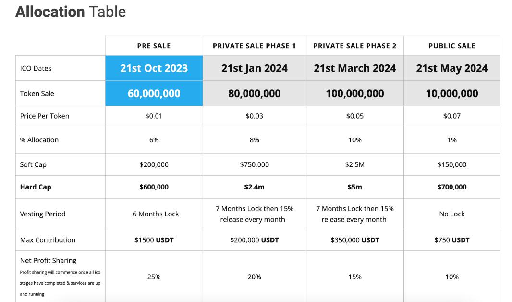

# Bitfinder Smart Contract
1. BITFToken Smart contract: BitfToken smart contract
2. BITFPool Smart contract: This smart contract is designed for Founder's Pool, Ecosystem Pool, Search Engine Pool and Advisor Pool
3. TokenSale Smart contract: ICO Smart contract, It is for Presale, Private Sale #1, Private Sale #2 and Public Sale. All funtionalities for buy and claim are designed.
4. VCPool Smart contract: This smart contract is made for VCs especially

# Tokenomics

# Deployment Guide
Install dependencies: `npm install`

Create `pvKey.js` considering `pvKey_EXAMPLE.js` and replace fields

Run deployment scripts for Ethereum: `npx hardhat run scripts/deploy.js`
Verify deployed smart contracts: `npx hardhat verify --token contract address-- --construcotr-args aruments.js`

** Please fill contract addresses in arguments.js before verification, You can find contract addresses in your console after deployment **

Verify other smart contracts using above commands without arguments.

# Verify - Sepolia (Testnet for ETH) 
Token Contract: 
    npx hardhat verify --network sepolia  0xC58ddeA26751b783115Fc117d28b19EfdD16BADE --constructor-args arguments.js
    https://sepolia.etherscan.io/address/0xC58ddeA26751b783115Fc117d28b19EfdD16BADE#code
Sale Contract: 
    npx hardhat verify --network sepolia 0xf12835a0905f28235918Cf37160e20D48ffa3483 0xdac17f958d2ee523a2206206994597c13d831ec7
    https://sepolia.etherscan.io/address/0xf12835a0905f28235918Cf37160e20D48ffa3483#code
Founder Pool:
    npx hardhat verify --network sepolia 0xf054Df2A16c90F07d49079E8fbFaB599cae7723E Founders 53200000000000000000000000 
    https://sepolia.etherscan.io/address/0xf054Df2A16c90F07d49079E8fbFaB599cae7723E#code
Ecosystem Pool:
    npx hardhat verify --network sepolia 0xf25CA1eBd45b37631666f3EDb9D9BE945d3C18a8 EcoSystem 62000000000000000000000000
    https://sepolia.etherscan.io/address/0xf25CA1eBd45b37631666f3EDb9D9BE945d3C18a8#code
Search Engine Pool:
    npx hardhat verify --network sepolia 0xCCCE2bd1175d73B618e477c6f1eDd61dd3624dc1 SearchEngine 42200000000000000000000000
    https://sepolia.etherscan.io/address/0xCCCE2bd1175d73B618e477c6f1eDd61dd3624dc1#code
Advisor Pool:
    npx hardhat verify --network sepolia 0x06a58aa3AEBB459e93fAaC9F8c2f346475a7BfA3 Advisor 22300000000000000000000000
    https://sepolia.etherscan.io/address/0x06a58aa3AEBB459e93fAaC9F8c2f346475a7BfA3#code
# Testnet
Sepolia: 

    BITFToken is deployed to: 0xB8ad3f6699b6B78828B1A3A224e9Eef2a1Fa4D06
    TokenSale Contract is deployed to: 0xF4D5f9e9Ce3F9DE21199Aa8201Fbb825A2A127D4
    Marketing Pool is deployed to: 0xEC902a5CdBD9FdEA169a9d13035f7eA4857A6f46
    Founder Pool is deployed to: 0x55361071178B5389DfA98E41154ed6F280b7762A
    Eco System Pool is deployed to: 0x50B67c32b4dC9a05Cdc3FC34e9911dC5Bc514739
    Search Engine Pool is deployed to: 0x42Ab35A40bBb63d7298105061F5e405BD215E7EA
    Advisor Pool is deployed to: 0x566Ca09a1A1022425a96d2f9F4CaeF81F5d82a66
    VC Pool is deployed to: 0x07C38d70B223003e2395f06566bCc92f596D7afE